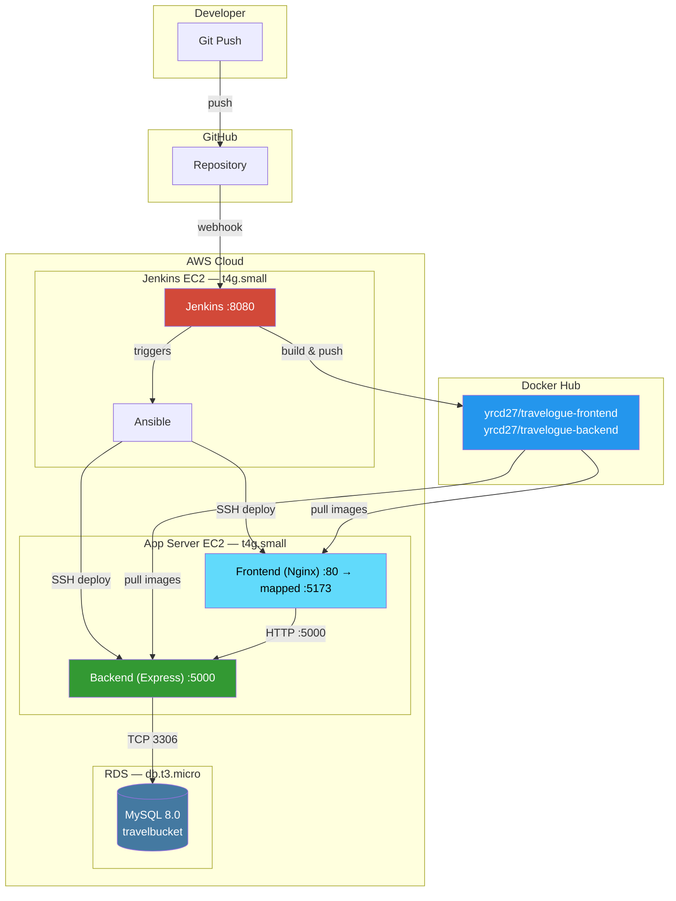
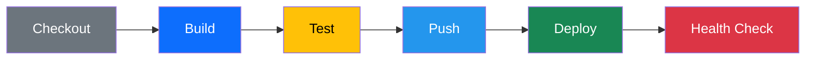
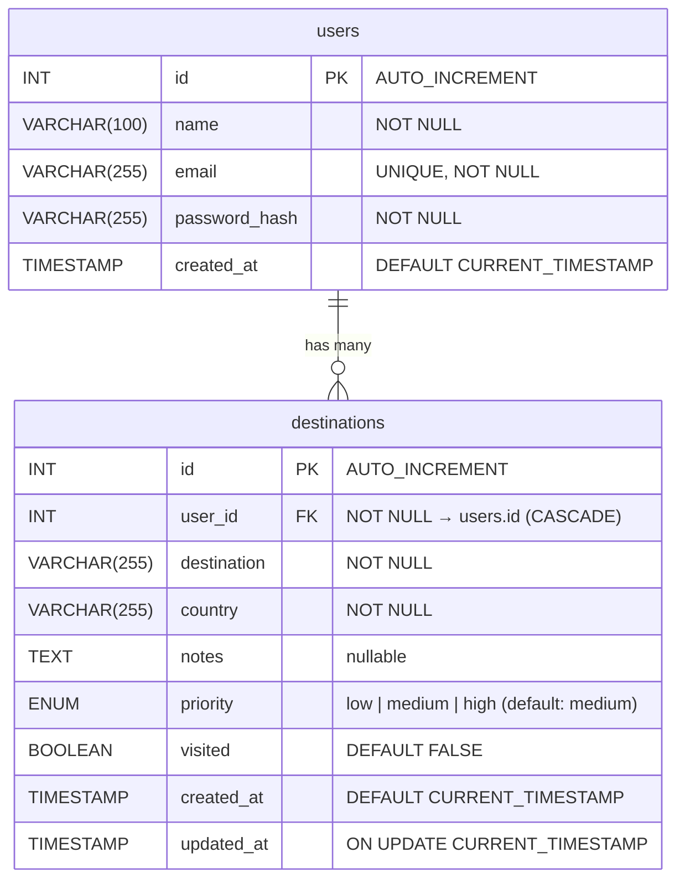
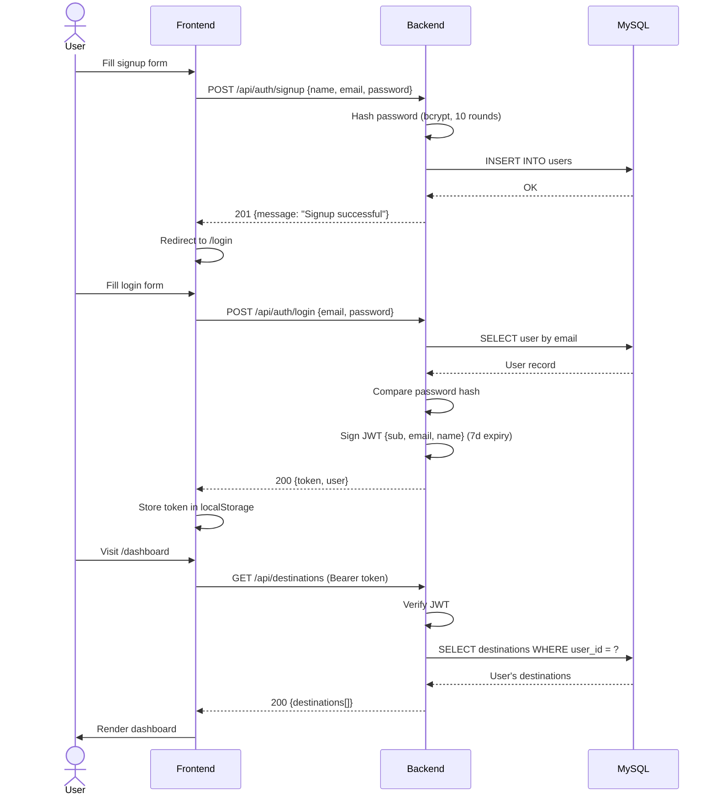

<div align="center">

# Travelogue - Personal Travel Bucket List

A full-stack app with a complete DevOps pipeline from infrastructure provisioning to automated deployment.

[](https://reactjs.org)
[](https://nodejs.org)
[](https://www.mysql.com)
[](https://www.docker.com)
[](https://www.jenkins.io)
[](https://www.terraform.io)
[](https://www.ansible.com)
[](https://aws.amazon.com)

</div>

---

## Table of Contents

- [Architecture Overview](#architecture-overview)
- [CI/CD Pipeline](#cicd-pipeline)
- [Project Structure](#project-structure)
- [Tech Stack](#tech-stack)
- [Database Schema](#database-schema)
- [API Reference](#api-reference)
- [Authentication Flow](#authentication-flow)
- [Getting Started](#getting-started)
- [Infrastructure Setup](#infrastructure-setup)
- [Environment Variables](#environment-variables)

---

## Architecture Overview



### AWS Infrastructure (provisioned by Terraform)

| Resource | Type | Specs | Purpose |
|----------|------|-------|---------|
| VPC | `10.0.0.0/16` | 2 subnets, IGW, route table | Network isolation |
| Jenkins Server | EC2 `t4g.small` | ARM64, 2 vCPU, 2GB RAM, 30GB | CI/CD + builds |
| App Server | EC2 `t4g.small` | ARM64, 2 vCPU, 2GB RAM, 20GB | Production hosting |
| Database | RDS `db.t3.micro` | MySQL 8.0, 20GB, encrypted | Persistent storage |
| Elastic IPs | 2 | Static public IPs | Stable addressing |
| Security Groups | 3 | App, Jenkins, RDS | Network firewall |

---

## CI/CD Pipeline



| Stage | What happens |
|-------|-------------|
| **Checkout** | Pull latest code from GitHub |
| **Build** | Build ARM64 Docker images for frontend and backend (parallel) |
| **Test** | Run backend tests (Mocha) + frontend lint (ESLint) + smoke tests (parallel) |
| **Push** | Authenticate and push images to Docker Hub |
| **Deploy** | Ansible SSHs into App Server, pulls images, recreates containers |
| **Health Check** | Wait 15s, then `curl` the frontend to verify it's live |

**Trigger:** GitHub webhook on push to `main` → Jenkins pipeline starts automatically.

---

## Project Structure

```
├── frontend/                   React + Vite + TailwindCSS
│   ├── src/
│   │   ├── pages/              Landing, Login, Signup, Dashboard
│   │   ├── components/         Nav, ProtectedRoute, ConfirmationModal
│   │   └── lib/api.js          Axios client with JWT interceptor
│   ├── nginx.conf              Gzip, SPA routing, security headers
│   └── Dockerfile              Multi-stage: Node build → Nginx serve
│
├── backend/                    Node.js + Express
│   ├── src/
│   │   ├── server.js           Express app, middleware stack, port 5000
│   │   ├── db.js               MySQL connection pool (10 connections)
│   │   ├── routes/             auth.js, destinations.js
│   │   └── middleware/         auth, security, validation, errorHandler
│   ├── tests/api.test.js       Mocha test suite
│   └── Dockerfile              Node 20 Alpine
│
├── db/
│   ├── init.sql                Schema + seed data (20 users, 60+ destinations)
│   └── destinations_data.sql   Additional sample data
│
├── terraform/                  AWS infrastructure
│   ├── main.tf                 VPC, EC2 instances, security groups, EIPs
│   ├── variables.tf            Input variables
│   └── outputs.tf              IPs, URLs, SSH commands
│
├── ansible/                    Configuration management
│   ├── deploy.yml              Main playbook (3 roles)
│   └── roles/
│       ├── docker/             Install Docker + Compose
│       ├── app-deploy/         Pull images, generate compose, start containers
│       └── health-check/       Verify containers + API endpoints
│
├── docker-compose.yml          Local development (MySQL + backend + frontend)
└── Jenkinsfile                 6-stage CI/CD pipeline
```

---

## Tech Stack

| Layer | Technology | Details |
|-------|-----------|---------|
| Frontend | React 19, Vite, TailwindCSS | SPA with React Router, Axios, Lucide icons |
| Backend | Node.js 20, Express 4.19 | REST API with JWT auth, rate limiting, input validation |
| Database | MySQL 8.0 | Managed via AWS RDS, connection pooling |
| Containerization | Docker, Docker Compose | Multi-stage builds, ARM64 images |
| CI/CD | Jenkins | 6-stage pipeline with GitHub webhook trigger |
| IaC | Terraform | VPC, EC2, RDS, security groups, elastic IPs |
| Config Management | Ansible | 3 roles: docker install, app deploy, health check |
| Cloud | AWS | EC2 (Graviton2 ARM64), RDS, VPC |
| Web Server | Nginx | Static file serving, gzip, SPA routing, security headers |

---

## Database Schema



---

## API Reference

Base URL: `http://<server>:5000`

### Authentication — `/api/auth`

| Method | Endpoint | Auth | Body | Response |
|--------|----------|------|------|----------|
| `POST` | `/signup` | No | `{name, email, password}` | `201` — `{message}` |
| `POST` | `/login` | No | `{email, password}` | `200` — `{token, user}` |
| `GET` | `/me` | Yes | — | `200` — `{user}` |

### Destinations — `/api/destinations`

| Method | Endpoint | Auth | Body | Response |
|--------|----------|------|------|----------|
| `GET` | `/` | Yes | — | `200` — `{destinations[]}` |
| `POST` | `/` | Yes | `{destination, country, notes?, priority?}` | `201` — `{destination}` |
| `PUT` | `/:id` | Yes | `{destination, country, notes?, priority?}` | `200` — `{destination}` |
| `DELETE` | `/:id` | Yes | — | `200` — `{message}` |
| `PATCH` | `/:id/visited` | Yes | — | `200` — `{destination}` (toggles visited) |

### Health — `/api/health`

| Method | Endpoint | Auth | Response |
|--------|----------|------|----------|
| `GET` | `/` | No | `200` — `{ok: true, timestamp}` |

> **Auth header format:** `Authorization: Bearer <JWT_TOKEN>`
> JWT tokens expire after **7 days**.

### Middleware Stack

```
Request → Security Headers → Rate Limiter → CORS → Body Parser → [Auth] → [Validation] → Route Handler → Error Handler
```

| Middleware | Scope | Config |
|-----------|-------|--------|
| Security headers | All requests | X-Frame-Options, X-Content-Type-Options, X-XSS-Protection |
| Rate limiter | API: 100 req/15min | Auth endpoints: 50 req/15min |
| CORS | All requests | Credentials enabled, configurable origin |
| Body parser | All requests | JSON + URL-encoded, 10MB limit |
| JWT auth | Protected routes | Verifies token, attaches `req.user` |
| Validation | Destination routes | Validates destination, country, priority enum |

---

## Authentication Flow



---

## Getting Started

### Local Development with Docker (recommended)

```bash
git clone https://github.com/Yrcd27/Personal-Travel-Bucket-List.git
cd Personal-Travel-Bucket-List
docker compose up -d
```

This starts 3 containers:

| Service | Container | Port | Details |
|---------|-----------|------|---------|
| MySQL | travel-mysql | 3306 | Seeded with schema + sample data |
| Backend | travel-backend | 5000 | Express API with hot reload |
| Frontend | travel-frontend | 5173 | Nginx serving React build |

Open http://localhost:5173 — the app is ready.

### Without Docker

```bash
# Terminal 1 — Backend
cd backend
npm install
# Set DB_HOST, DB_USER, DB_PASSWORD, DB_NAME, JWT_SECRET in environment
npm start

# Terminal 2 — Frontend
cd frontend
npm install
npm run dev
```

---

## Infrastructure Setup

### 1. Provision with Terraform

```bash
cd terraform
cp terraform.tfvars.example terraform.tfvars   # edit with your values
terraform init
terraform plan
terraform apply
```

Creates: VPC + 2 subnets + IGW + 2 EC2 instances + RDS + 3 security groups + 2 elastic IPs.

### 2. Deploy with Ansible

```bash
cd ansible
# Update inventory.ini with the EC2 IPs from terraform output
ansible-playbook deploy.yml
```

Ansible runs 3 roles in order:
1. **docker** — installs Docker + Docker Compose on the app server
2. **app-deploy** — pulls images from Docker Hub, generates `docker-compose.yml`, starts containers
3. **health-check** — verifies containers are running and endpoints respond

### 3. Pipeline runs automatically

After Jenkins is configured with GitHub webhook, every push to `main` triggers the full pipeline:

```
git push → GitHub webhook → Jenkins → Build → Test → Push to Docker Hub → Ansible deploy → Health check
```

---

## Environment Variables

### Backend

| Variable | Dev Default | Description |
|----------|------------|-------------|
| `DB_HOST` | `mysql` | Database host (Docker service name or RDS endpoint) |
| `DB_USER` | `travel_user` | Database username |
| `DB_PASSWORD` | `userpassword123` | Database password |
| `DB_NAME` | `travel_bucket` | Database name |
| `JWT_SECRET` | — | Secret key for signing JWT tokens |
| `PORT` | `5000` | Express server port |
| `NODE_ENV` | `development` | `development` or `production` |
| `CORS_ORIGIN` | `http://localhost:5173` | Allowed CORS origin |

### Frontend (build-time)

| Variable | Dev Default | Description |
|----------|------------|-------------|
| `VITE_API_URL` | `http://localhost:5000` | Backend API base URL |

---

<div align="center">

**Built with React, Express, MySQL, Docker, Jenkins, Terraform, and Ansible on AWS.**

</div>
